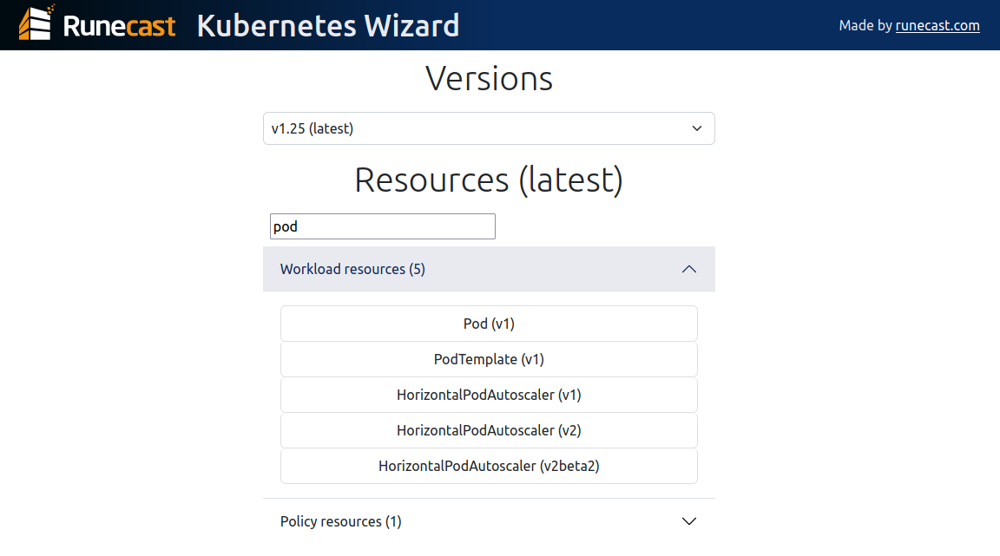
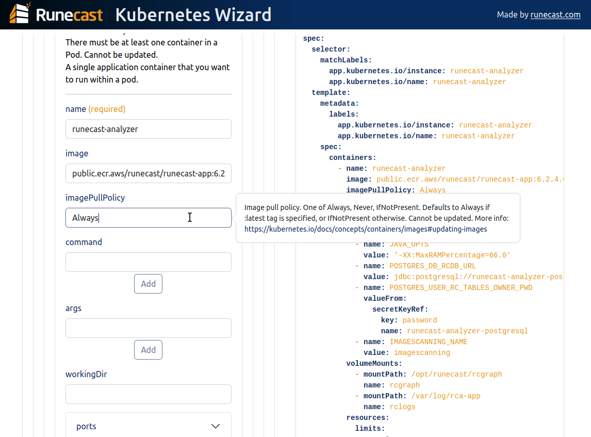
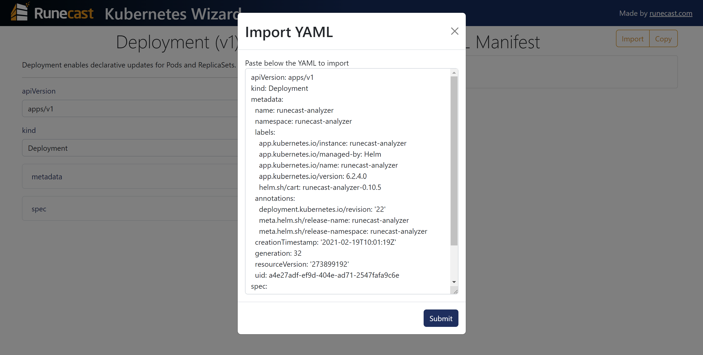

# K8s Wizard

---

This application facilitates the creation of Kubernetes YAML manifests by automatically generating YAML code based on user input provided through a form.

- [Usage](#usage)
- [For developers](#for-developers)
  - [Set up for production](#set-up-for-production)
  - [Set up for development](#set-up-for-development)
  - [Data modifications](#data-modifications)

## Usage

In the application, you can choose your Kubernetes version and select a resource. You can easily search for resources by entering (even partial) resource type. 



A form is created on the left panel, and the YAML will be generated on the right panel.
All data objects are collapsed by default but can be expanded to access their parameters.

You no longer need to go back and forth reading the API reference, the form contains all the needed information, e.g.:
- Descriptions
- Default values
- Possible values
- Parameter type
- Required



When filling out the form, the YAML is automatically generated.
When you're done, you can click on the "Copy" button and paste the results in your YAML manifest.

If you already have a working YAML manifest and want to modify it, you can import it in the application using the "Import" button.
This must be the first step after choosing a resource, as the button will be disabled as soon as a field of the form is filled out (to avoid silently overriding your inputs).



## For developers

### Set up for production

The project can be run using Docker with the command (use `sudo` if not in the Docker user group on Linux):
```bash
docker build -t k8s-wizard .
docker run -d -p 80:8000 -ti k8s-wizard
```
The front-end is built, then served by the back-end on port 80.
You can specify a different port number in the `docker run` command, but port 8080 is reserved for development.

By default, there is only one worker in production. If you need to change this, create a `.env` file at the root of the project (next to Dockerfile) with the following content:
```env
WORKERS=[n_workers]
```
where `[n_workers]` is a positive integer.
If you set this value to 0, the maximum number of workers will be used.

To run the container with the new configuration, use:
```bash
docker run --env-file=.env -d -p 80:8000 -ti k8s-wizard
```

### Set up for development

For development, you'll need Python 3.10+ and Node.js 16+.

The back-end can be started using the following:
```bash
cd backend
pip install -r requirements.txt  # Only the first time
python run_local.py
```
and the front-end can be started in another terminal session using:
```bash
cd frontend
npm install  # Only the first time
npm run serve
```
Once both the back-end and front-end are running, you can access the app by visiting http://localhost:8080 in your web browser.

### Data modifications

The JSON data files are obtained via the API reference scraping, but some information can be missing (e.g. default values, options...).
Some behaviors can also be added *a posteriori*, like the fact that we want to choose only one type of volume per volume in containers.
To easily add these changes to all the data files and avoid overwriting them if the data is scraped again, these changes are stored as a set of modifications added manually.

These modifications can be found in `./backend/src/modifications/modifications.yaml`.
Each one of them must have the following keys:
- `reference`
- `attribute`
- `action`
- `value` (except if the `action` is "drop attribute")

The references are the ones found in the JSON files.
The attribute can be `options` (possible values that are suggested), `required` (boolean), `predefined_value` (for each resource, this is the value automatically set for `apiVersion` and `kind`), `default` (used value if nothing is provided, usually appears as placeholder), `select_one` (when one object only must be filled).

In development mode, you can visit http://localhost:8080/modify to easily find the parameters' references and ensure the chosen values are consistent.
